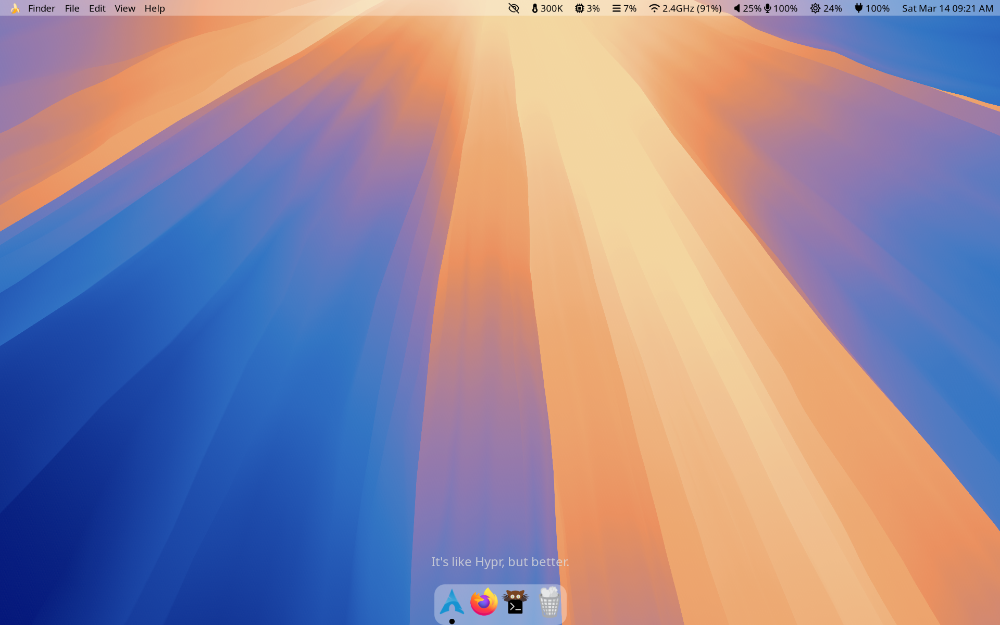
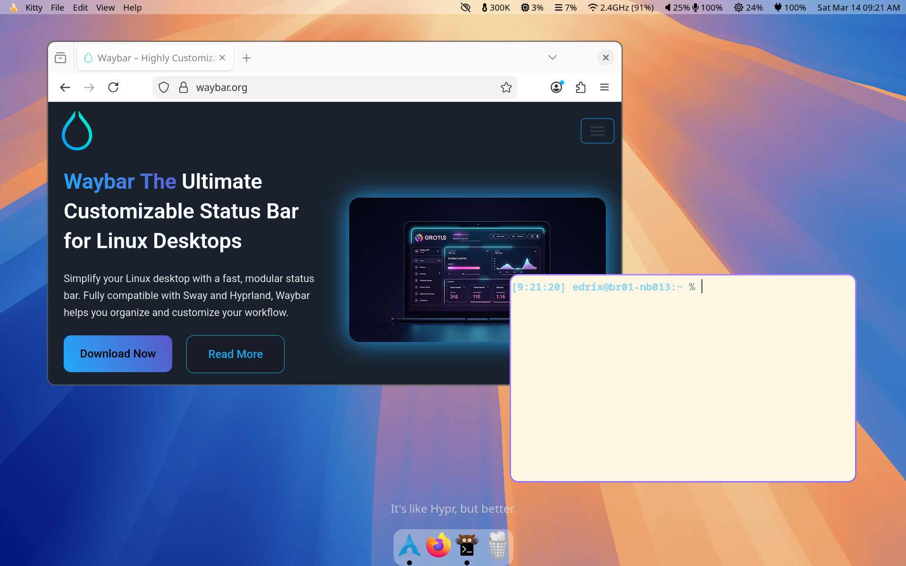
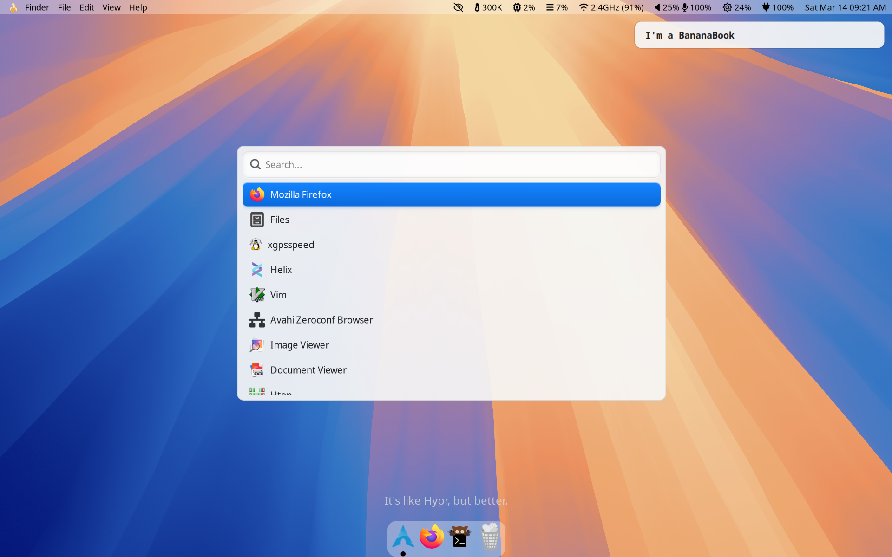

# dot-hyprmice

This repo contains dotfiles for MacOS-Inspired Cosmetic Enhancements (MICE) in Hyprland.
The setup is based on the great [waybar-macos-sequoia](https://github.com/kamlendras/waybar-macos-sequoia) by Kamlendra Singh, with some tweaks.

## Screenshots







## Usage

There are three ways to use these dotfiles.

1. Browse the directories, read the dotfiles, and copy-paste the bits and pieces you like.
2. Use [GNU stow](https://www.gnu.org/software/stow/) to symlink the dotfiles directly to your home directory.
2. Manually copy or symlink the dotfiles to your home directory.

#### Example with GNU stow

The first step is to clone the repository.

```{bash}
git clone git@github.com:fmarotta/dot-hyprmice.git
cd dot-hyprmice
```

Make sure that an up-to-date version of [GNU stow](https://www.gnu.org/software/stow/) is installed, then run:

```{bash}
stow {hypr,waybar,mako,wofi}
```
